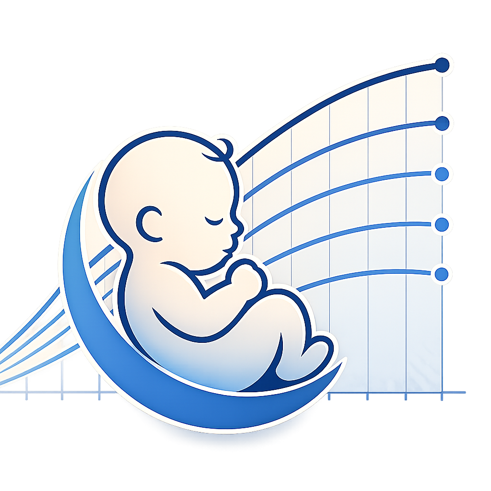

<p align="center">
  
</p>

# Auxology

Desktop aplikace pro sledování růstu nedonošených dětí na základě referenčních auxologických dat Centra komplexní péče KDDL VFN Praha (LMS kvantilová regrese, 1 781 dětí, 5 676 vyšetření, 2001–2015).

Auxology běží plně offline v prostředí Electron, data zůstávají na uživatelském počítači (IndexedDB / LoveField).

## Dokumentace

- 🇨🇿 [Uživatelská příručka (CZ)](docs/user-guide-cs.html)
- 🇬🇧 [User guide (EN)](docs/user-guide.html)
- [CHANGELOG](CHANGELOG.md)

## Instalace

Stáhněte si nejnovější build pro macOS nebo Windows z [Releases](https://github.com/jirihelmich/auxology/releases/latest).

## Vývoj

```bash
npm install          # nainstalovat závislosti
npm run dev          # Vite dev server (pouze browser, hot reload)
npm start            # sestavit + spustit jako Electron
npm run build:mac    # macOS .dmg do dist/
npm run build:win    # Windows NSIS do dist/
npm run build        # obojí
npx tsc --noEmit     # typecheck
```

## Stack

React 19 + TypeScript + Tailwind CSS 4 · Recharts · LoveField (IndexedDB) · Electron.

## Licence

Kód je uvolněn pod [CC0 1.0](LICENSE.md). Referenční auxologická data pocházejí z projektu KDDL VFN Praha (viz přihlašovací obrazovka aplikace pro plné uvedení autorů).
