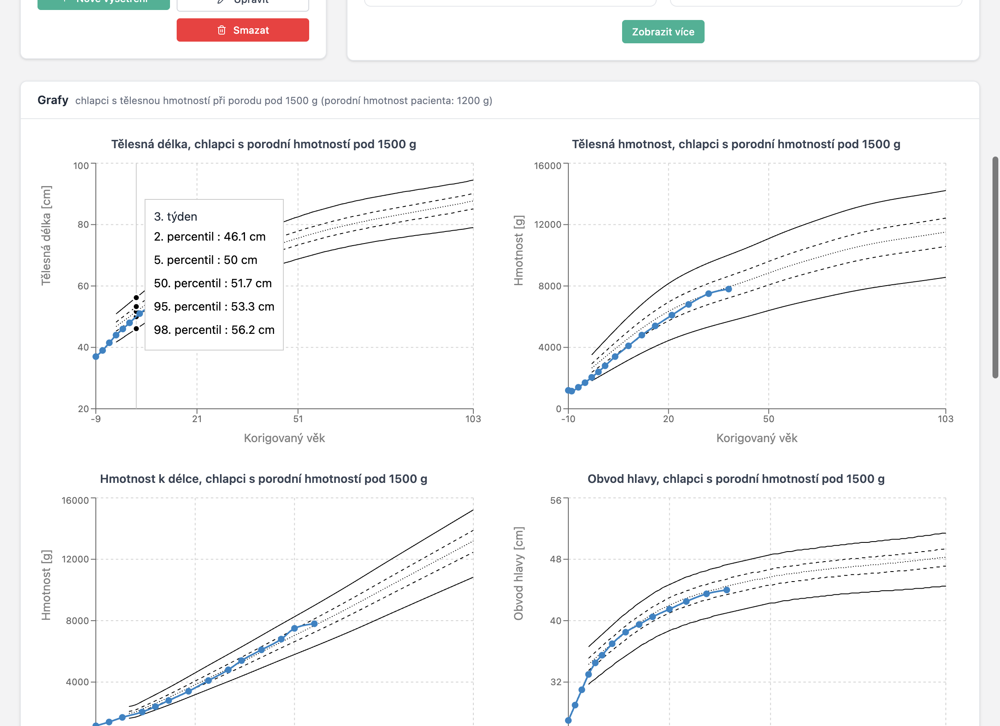

# ImaGrow — Uživatelská příručka

ImaGrow (dříve vydávaná pod názvem Auxologie) je desktopová aplikace určená pro neonatology a pediatrické lékaře, kteří potřebují sledovat růst předčasně narozených dětí. Aplikace je postavena na českých referenčních auxologických datech — percentilových růstových grafech odvozených ze studie 1 781 nedonošených dětí (5 676 vyšetření) v Centru komplexní péče, KDDL VFN Praha, v období 2001–2015.

Všechna data jsou uložena lokálně ve vašem počítači. Aplikace neobsahuje žádnou cloudovou komponentu — funguje zcela offline. Běží na macOS i Windows.

Rozhraní je dostupné v **češtině** a **angličtině**. Mezi jazyky lze přepínat kdykoli a vaše preference se zapamatuje.

**Stáhnout:** [macOS (DMG)](https://github.com/jirihelmich/auxology/releases/download/v3.2.0/Auxology-3.2.0-arm64.dmg) · [Windows (EXE)](https://github.com/jirihelmich/auxology/releases/download/v3.2.0/Auxology-Setup-3.2.0.exe) · [Všechny verze](https://github.com/jirihelmich/auxology/releases/latest)

---

## Začínáme

### Vytvoření účtu

Při prvním spuštění aplikace se zobrazí přihlašovací obrazovka. Protože aplikace ukládá data lokálně, váš účet existuje pouze na vašem počítači — není sdílen s nikým.

Klikněte na **Vytvořit účet** pro nastavení uživatelského jména a hesla. Po registraci budete přesměrováni zpět na přihlašovací obrazovku.

Pro přepnutí jazyka rozhraní před přihlášením použijte přepínač **EN/CZ** v pravém horním rohu přihlašovací stránky. Uvnitř aplikace je stejný přepínač dostupný v dolní části postranního menu.

### Přehled pacientů

Po přihlášení se zobrazí přehled. Nahoře jsou **čtyři statistické karty** (počet pacientů celkem, vyšetření za 7 / 30 dní, počet pacientů vyžadujících pozornost), pod nimi prominentní **vyhledávací pole** a tabulka nedávných pacientů. Vpravo je panel **„Vyžaduje pozornost"** — pacienti, kteří nebyli vyšetřeni přes 30 dní, seřazení podle nejdéle čekajících. Pokud není koho upozorňovat, zobrazí se zelený check „Vše v pořádku".

Vyhledávání je **živé** — výsledky se ukazují s krátkou prodlevou při psaní, není potřeba klikat na tlačítko. Pole rozumí čtyřem typům vstupu:

- **Jméno nebo příjmení** (s diakritikou i bez ní, např. „novak", „Nováková").
- **Rodné číslo v plném tvaru** včetně lomítka, např. `260212/2457`.
- **Část rodného čísla** — stačí prvních 6 číslic (datum narození zakódované v r.č.).
- **Datum narození** ve tvaru `1.4.2025`, `01.04.2025` nebo `1. 4. 2025` — aplikace si datum převede a najde všechny děti narozené ten den (s ohledem na +50 měsíc u dívek).

Výsledky se zobrazí v tabulce s ID, jménem, pohlavím, rodným číslem, datem narození, gestačním stářím při narození a porodní hmotností. Kliknutím na jméno pacienta přejdete na jeho detail. Kliknutím na ikonu info se otevře panel náhledu s časovou osou vyšetření.

---

## Práce s pacienty

### Registrace nového pacienta

Klikněte na **Nový pacient** pro otevření registračního formuláře. Čtyři pole jsou povinná:

1. **Rodné číslo** — české národní identifikační číslo. Aplikace automaticky vypočítá datum narození a ověří kontrolní součet. U žen je měsíc kódován s +50 dle českého standardu.
2. **Pohlaví** — Dívka nebo Chlapec.
3. **Porodní hmotnost** — v gramech. Maximum je 2500 g (práh nedonošenosti).
4. **Gestační týden při narození** — týden gestace, kdy se dítě narodilo (maximum 37).

Volitelně můžete zadat jméno dítěte, plánovaný termín porodu, porodní délku v cm, obvod hlavy při narození v cm a poznámky.

Sekce **Matka** a **Otec** jsou ve formuláři **defaultně sbalené**, protože pro běžnou auxologii nejsou potřeba — rozbalí se kliknutím na „Zobrazit" v hlavičce sekce. Pokud při editaci pacienta už údaje o rodičích vyplněné jsou, sekce se rozbalí automaticky.

### Detail pacienta

Detail pacienta je hlavní pracovní prostor pro jednotlivé dítě. Levý sloupec ukazuje **čtyři statistické boxy** s nejdůležitějšími fakty — gestační týden při porodu, porodní hmotnost, korigovaný věk a kalendářní věk. Pod nimi jsou sparkline grafy posledních hodnot délky, hmotnosti a obvodu hlavy a v jednom řádku akce (Nové vyšetření, Upravit, Smazat). Méně časté údaje (kalkulovaný a plánovaný termín porodu, aktuální gestační věk) jsou skryté pod tlačítkem **„Další údaje o věku a termínu"**.

Pravý sloupec ukazuje **historii vyšetření** jako kompaktní timeline — každé vyšetření jako jeden řádek s datem, korigovaným věkem a třemi naměřenými hodnotami. Edit/smazat ikony se objeví při najetí myší.

V hlavičce stránky vpravo nahoře je tlačítko **„← Seznam pacientů"** pro rychlý návrat zpátky.

Karta s **údaji o rodičích** se zobrazí jen tehdy, když má alespoň jeden z nich vyplněná data; standardně je sklopená a uvnitř se nezobrazují prázdná pole.

---

## Sledování růstu v čase

Hlavním účelem aplikace ImaGrow je sledovat, jak předčasně narozené dítě roste ve srovnání s referenčními daty. To se provádí zaznamenáváním vyšetření při každé klinické návštěvě a prohlížením výsledných grafů a statistik.

### Záznam vyšetření

Na stránce detailu pacienta klikněte na **Nové vyšetření**. Formulář požaduje datum vyšetření, délku těla a obvod hlavy v centimetrech (s desetinnou čárkou nebo tečkou), hmotnost v gramech a volitelné poznámky.

Vedle každého vstupního pole se zobrazuje **subtilní hint** s poslední naměřenou hodnotou (např. „naposledy 52.0 cm"). Pokud ještě žádné vyšetření neexistuje, ukáže se porodní hodnota. Klávesa **Enter** ve formuláři neodesílá — mezi poli se přechází tabulátorem a pro uložení slouží tlačítko vpravo dole.

**Živý náhled** pod formulářem ukazuje čtyři růstové grafy, které se aktualizují s každým úhozem klávesy. Doktor okamžitě vidí, kde nová hodnota padne v percentilových pásmech, ještě před uložením.

### Růstové grafy

Po zaznamenání alespoň jednoho vyšetření se na stránce detailu pacienta zobrazí čtyři růstové grafy, které vykreslují měření dítěte proti referenčním percentilovým křivkám. Zobrazené percentilové linie jsou 2., 5., 50., 95. a 98. — vypočtené pomocí metody kvantilové regrese LMS.

Čtyři grafy jsou:

- **Délka těla** vs. korigovaný věk
- **Hmotnost** vs. korigovaný věk
- **Obvod hlavy** vs. korigovaný věk
- **Hmotnost k délce** (hmotnost vynesená proti délce těla místo věku)

Referenční křivky jsou vybrány automaticky na základě pohlaví dítěte a zda jeho porodní hmotnost byla nad nebo pod 1500 g. Datové body dítěte jsou spojeny barevnou linií (modrá pro chlapce, červená pro dívky).

Při najetí myší na bod pacienta tooltip ukazuje korigovaný věk, naměřenou hodnotu a vypočtený **percentil**.

V pravém horním rohu každého grafu je tlačítko **Stáhnout (PNG)** — kliknutím se uloží obrázek grafu ve dvojnásobném rozlišení, s bílým pozadím a názvem grafu. Soubor má jméno ve tvaru `Jméno-Příjmení-Tělesná-délka.png` a hodí se k vložení do propouštěcí zprávy.

### Tabulková data

Pod grafy je souhrnná tabulka se všemi vyšetřeními v chronologickém pořadí. Pro každou návštěvu tabulka ukazuje datum, korigovaný věk a pro každé ze tří měření (hmotnost, délka, obvod hlavy) jak naměřenou hodnotu, tak vypočtený **percentil** a **SDS/Z-skóre**. Samostatný sloupec ukazuje percentil a Z-skóre hmotnosti k délce.

Z-skóre 0 odpovídá 50. percentilu. Hodnoty pod −2 nebo nad +2 indikují měření mimo normální rozsah a mohou vyžadovat klinickou pozornost. Buňky s percentilem **pod 1.** nebo **nad 99.** se v tabulce zvýrazňují červeně, aby šly extrémní záznamy snadno najít.

---

## Referenční grafy

Sekce **Grafy**, přístupná z postranního menu, zobrazuje referenční percentilové křivky bez překrytí daty pacienta. To je užitečné pro tisk prázdných grafů, pro vzdělávací účely nebo pro porovnání s měřeními provedenými mimo aplikaci.

Čtyři záložky umožňují přepínat mezi referenčními populacemi:

- Chlapci s porodní hmotností pod 1500 g
- Dívky s porodní hmotností pod 1500 g
- Chlapci s porodní hmotností nad 1500 g
- Dívky s porodní hmotností nad 1500 g

---

## Profil lékaře

Sekce **Profil** umožňuje zadat vaše profesní údaje: titul před jménem (např. RNDr., MUDr.), jméno, příjmení, titul za jménem (např. Ph.D.) a pracoviště. Tyto informace se zobrazují v postranním menu.

---

## Zálohování a aktualizace

Aplikace ukládá data výhradně na vašem počítači. Neexistuje cloudová záloha ani synchronizace — pokud se počítač ztratí, rozbije nebo přeinstaluje, mizí s ním i data. Dva praktické způsoby, jak mít bezpečnostní kopii:

### Ruční export z aplikace

Na úvodní obrazovce je vpravo nahoře tlačítko **Export**. Klepnutím se stáhne soubor `auxology-export.json` s kompletní databází — pacienti, vyšetření, údaje o rodičích. Uložte ho někam mimo aplikaci: sdílený disk, OneDrive, externí disk. Týdenní rytmus je rozumné minimum; export určitě udělejte před větší změnou (import více pacientů, aktualizace aplikace).

Pokud by se cokoli stalo s vaší instalací, pošlete mi ten JSON e-mailem a data obnovíme. Aplikace zatím nemá tlačítko **Import** pro svépomocnou obnovu — pokud to bude potřeba, napište mi a doplním ho.

### Zálohování celé složky (pro IT nemocnice)

Databáze leží v uživatelském profilu operačního systému:

- **Windows:** `C:\Users\<uživatel>\AppData\Roaming\auxology\IndexedDB\`
- **macOS:** `~/Library/Application Support/ImaGrow/IndexedDB/`

Celá složka `IndexedDB` je kompletní databáze. IT oddělení může tuto cestu zahrnout do standardní zálohy uživatelských profilů (Windows Backup, roaming profily, Time Machine, OneDrive Known Folder Move). V okamžiku zálohy by aplikace měla být zavřená — soubor LevelDB může být uzamčen běžící aplikací a záloha by pak byla nekonzistentní. Ideální je plánovaná noční záloha mimo pracovní dobu.

### Aktualizace na novou verzi

Instalace novější verze se **nedotkne** databáze. Instalátor nahrazuje jen binárky aplikace v `/Applications/` (macOS) nebo `Program Files\ImaGrow\` (Windows); vaše data v uvedené profilové složce zůstanou beze změny. Nová verze otevře existující IndexedDB, ověří uložené číslo verze schématu a migraci spustí jen tehdy, když se struktura mezi verzemi změnila.

Doporučený postup aktualizace:

1. Otevřít ImaGrow a kliknout **Export** na úvodní stránce; uložit JSON někam bokem.
2. Zavřít ImaGrow.
3. Nainstalovat novou verzi (drag-and-drop `.app` na macOS, spustit `.exe` na Windows).
4. Spustit novou verzi a ověřit, že je seznam pacientů pořád vidět.
5. Kdyby cokoli nesedělo, pošlete mi JSON uložený v kroku 1.

Při **odinstalaci** konkrétní verze instalátor defaultně datovou složku ponechá. Databáze se smaže až ručním odstraněním `~/Library/Application Support/ImaGrow/` (macOS) nebo `%APPDATA%\ImaGrow\` (Windows), případně zaškrtnutím volby „odstranit uživatelská data", pokud je při odinstalaci nabídnuta.

---

## Další informace

### Data a soukromí

Všechna data pacientů jsou uložena v lokální databázi IndexedDB ve vaší instanci prohlížeče/Electronu. Nic se nepřenáší po síti. Pokud potřebujete přenést data na jiný počítač, použijte funkci **Export** na přehledu pacientů.

### Automatické odhlášení

Z bezpečnostních důvodů vás aplikace automaticky odhlásí po **60 minutách** nečinnosti. **10 minut před vypršením** se v horní části aplikace objeví žlutý pruh s odpočtem (např. „Pro nečinnost budete za 9:42 odhlášeni") a tlačítkem **„Zůstat přihlášen"**, kterým se odpočet zruší.

### Statistické pozadí

Referenční data jsou založena na longitudinální studii nedonošených dětí v České republice:

| | |
|---|---|
| **Velikost vzorku** | 1 781 dětí (846 dívek, 935 chlapců) |
| **Vyšetření** | 5 676 celkem |
| **Věkový rozsah** | 37. až 109. týden gestačního stáří |
| **Instituce** | Centrum komplexní péče, KDDL VFN Praha |
| **Období** | 2001–2015 |
| **Metoda** | Kvantilová regrese LMS |
| **Percentily** | 2., 5., 50., 95., 98. |
| **Měření** | Délka těla, hmotnost, obvod hlavy, hmotnost k délce |
| **Hmotnostní kategorie** | Pod 1500 g / nad 1500 g při narození |
