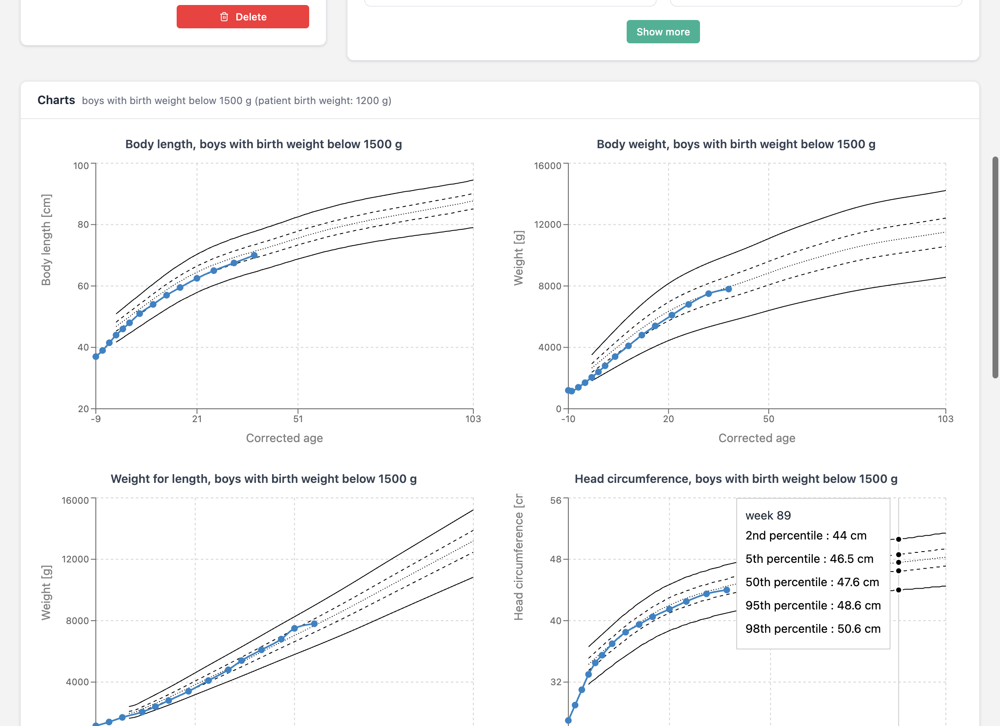

# Auxology — User Guide

Auxology is a desktop application designed for neonatologists and paediatric clinicians who need to monitor the growth of prematurely born children. The application is built around Czech reference auxological data — percentile growth charts derived from a study of 1,781 premature children (5,676 examinations) at the Centre of Comprehensive Care, KDDL VFN Prague, between 2001 and 2015.

All data is stored locally on your computer. There is no cloud component — the application works entirely offline. It runs on both macOS and Windows.

The interface is available in **Czech** and **English**. You can switch between the two at any time, and your preference is remembered across sessions.

**Download:** [macOS (DMG)](https://github.com/jirihelmich/auxology/releases/download/v3.2.0/Auxology-3.2.0-arm64.dmg) · [Windows (EXE)](https://github.com/jirihelmich/auxology/releases/download/v3.2.0/Auxology-Setup-3.2.0.exe) · [All releases](https://github.com/jirihelmich/auxology/releases/latest)

---

## Getting Started

### Creating an Account

When you launch Auxology for the first time, you are presented with the login screen. Since the application stores data locally, your account exists only on your machine — it is not shared with anyone.

Click **Create account** to set up a username and password. Once registered, you are redirected back to the login screen where you can sign in with your new credentials.

To switch the interface language before logging in, use the **EN/CZ** toggle in the top-right corner of the login page. Inside the application, the same toggle is available at the bottom of the sidebar navigation.

### The Dashboard

After signing in, you land on the dashboard. The top row contains **four stat cards** (total patients, examinations in the last 7 / 30 days, and a count of patients needing attention). Below them is a prominent **search bar** and the recent-patients table, with a **"Needs attention"** panel on the right listing patients who haven't been examined in over 30 days. If everybody is current, a green check confirms "All caught up".

Search is **live** — results refresh as you type, no Enter or button click required.

The search bar understands four types of input:

- **Name or surname** (with or without diacritics, e.g. "novak", "Nováková").
- **Full birth number** including the slash, e.g. `260212/2457`.
- **Partial birth number** — the first six digits (the date of birth encoded in the birth number) are sufficient.
- **Date of birth** in `1.4.2025`, `01.04.2025` or `1. 4. 2025` format — the application converts the date and finds all children born on that day (handling the +50 month offset for girls and other technical variants).

Results appear in a table that shows each patient's ID, name, gender, birth number, date of birth, gestational age at birth, and birth weight. Clicking a patient's name takes you to their detail page. Clicking the info icon on the right opens a preview panel with a timeline of examinations and quick-action links.

---

## Working with Patients

### Registering a New Patient

Click **New patient** on the dashboard to open the registration form. Four fields are required:

1. **Birth number** (rodné číslo) — the Czech national identification number. The application automatically computes the date of birth and validates the checksum. For female patients, the month is encoded with +50 as per the Czech standard.
2. **Gender** — Girl or Boy.
3. **Birth weight** — in grams. The maximum is 2500 g (the threshold for prematurity).
4. **Gestational week at birth** — the week of gestation when the child was born (maximum 37).

You can optionally provide the child's name, planned due date, birth length in cm, head circumference at birth in cm, and free-text notes.

The **Mother** and **Father** sections are **collapsed by default**, since they are not required for routine auxology — expand them via the "Show" button in the section header. When editing a patient who already has parent data on record, the sections expand automatically.

After saving, you are taken directly to the new patient's detail page.

### The Patient Detail Page

The patient detail page is the main workspace for a single child. The left column shows **four stat boxes** with the most important facts — gestational age at birth, birth weight, corrected age, and calendar age. Below them are sparkline charts of the latest length, weight, and head circumference, then a single row of actions (New examination, Edit, Delete). Less common dates (calculated and planned due date, current gestational age) live behind a **"More dates and age info"** toggle.

The right column shows the **examination history** as a compact timeline — each examination is one row with the date, corrected age, and the three measurements inline. Edit / delete icons appear on hover.

The page header has a **"← Patient list"** button (top right) for quick navigation back to the dashboard.

The **parent information card** is hidden entirely if neither parent has any data on record; otherwise it is collapsed by default and skips empty fields when expanded.

---

## Tracking Growth Over Time

The core purpose of Auxology is to track how a premature child grows relative to reference data. This is done by recording examinations at each clinical visit and reviewing the resulting charts and statistics.

### Recording an Examination

From the patient detail page, click **New examination**. The form asks for:

- **Examination date** — pre-filled with today's date (no time).
- **Body length** — in centimetres (decimal point or comma accepted; stored internally in millimetres for precision).
- **Body weight** — in grams.
- **Head circumference** — in centimetres.
- **Notes** — free text for clinical observations.

A subtle **hint** next to each input field shows the most recent measured value (e.g. "last 52.0 cm"). When no examination yet exists, the birth measurement is shown instead. Pressing **Enter** in the form does not submit it — moving between fields is done with Tab, and the form is saved only by the button at the bottom right.

A **live preview** below the form shows four growth charts that update with every keystroke. The clinician sees immediately where the new measurement will fall against the reference percentile bands, before saving.

### Growth Charts

Once at least one examination is recorded, the patient detail page shows four growth charts that plot the child's measurements against reference percentile curves. The percentile lines shown are the 2nd, 5th, 50th, 95th, and 98th — computed using the LMS quantile regression method.

The four charts are:

- **Body length** vs. corrected age
- **Body weight** vs. corrected age
- **Head circumference** vs. corrected age
- **Weight for length** (weight plotted against body length rather than age)

The reference curves are selected automatically based on the child's gender and whether their birth weight was above or below 1500 g. The child's own data points are connected by a coloured line (blue for boys, red for girls), making it easy to see at a glance whether growth is following, crossing, or deviating from the expected percentile bands.

Hovering over a patient data point shows a tooltip with the corrected age, the measured value, and the calculated **percentile**.

In the top-right corner of every chart there is a **Download (PNG)** button — clicking it saves a 2× resolution PNG of the chart with a white background and the chart title baked in. The file name has the form `Firstname-Surname-Body-length.png` and is ready for inclusion in a discharge report.

Clicking the body of any chart opens it in a full-screen view for closer inspection or discussion with colleagues.

### Tabulated Data

Below the charts, a summary table lists every examination chronologically. For each visit, the table shows:

| Column | Description |
|---|---|
| **Date** | When the examination took place |
| **Corrected age** | Age adjusted for prematurity |
| **Weight [g]** | Measured body weight |
| **Weight P** | Weight percentile relative to the reference population |
| **Weight SDS** | Weight standard deviation score (Z-score) |
| **Length [cm]** | Measured body length |
| **Length P / SDS** | Length percentile and Z-score |
| **Head circ. [cm]** | Measured head circumference |
| **Head circ. P / SDS** | Head circumference percentile and Z-score |
| **Weight-for-length P / SDS** | How the child's weight relates to their length |

Percentiles and Z-scores are computed against the appropriate reference dataset (gender × weight category). A Z-score of 0 corresponds to the 50th percentile; values below −2 or above +2 indicate measurements outside the normal range and may warrant clinical attention. Cells with a percentile **below 1** or **above 99** are highlighted in red so extreme values stand out.

---

## Reference Charts

The **Charts** section, accessible from the sidebar, displays the reference percentile curves without any patient data overlaid. This is useful for printing blank charts, for educational purposes, or for comparing against measurements taken outside the application.

Four tabs let you switch between the reference populations:

- Boys with birth weight below 1500 g
- Girls with birth weight below 1500 g
- Boys with birth weight above 1500 g
- Girls with birth weight above 1500 g

Each tab shows full-size charts for body length, body weight, weight-for-length, and head circumference.

---

## Doctor Profile

The **Profile** section lets you enter your professional details: title prefix (e.g. RNDr., MUDr.), first name, surname, title suffix (e.g. Ph.D.), and workplace. This information is displayed in the sidebar so you can confirm which account is active.

---

## Backup & Upgrades

The application stores data entirely on your computer. There is no cloud backup or sync — if the computer is lost, replaced, or reinstalled, the data goes with it. Two practical ways to keep a safety copy:

### Manual export from the app

On the dashboard, the **Export** button (top right) downloads a single `auxology-export.json` file containing your complete database — patients, examinations, and parent data. Save it somewhere outside the app's storage: a shared drive, OneDrive, or an external disk. A weekly cadence is a reasonable default; do the export before any larger change (import of many patients, upgrade of the app).

If something happens to your installation, email that JSON to the author and the data will be restored. The app does not yet have a self-service Import button — if this becomes important, let me know and I'll add it.

### Folder-level backup (for hospital IT)

The underlying database lives in the operating system user profile:

- **Windows:** `C:\Users\<user>\AppData\Roaming\auxology\IndexedDB\`
- **macOS:** `~/Library/Application Support/auxology/IndexedDB/`

The whole `IndexedDB` folder is the complete database. Hospital IT can include this path in the standard user-profile backup (Windows Backup, roaming profiles, Time Machine, OneDrive Known Folder Move). Auxology should be closed during the backup window — the LevelDB file can be locked by a running process, which makes a backup inconsistent. A scheduled nightly backup when nobody is signed in is ideal.

### Upgrading to a new version

Installing a newer release does **not** touch the database. The installer replaces only the application binaries in `/Applications/` (macOS) or `Program Files\Auxology\` (Windows); your data in the profile folder above stays intact. The new version reads the existing IndexedDB, checks the stored schema version, and runs a migration only if the structure changed between releases.

Recommended upgrade routine:

1. Open Auxology and click **Export** on the dashboard; save the JSON somewhere safe.
2. Close Auxology.
3. Install the new version (drag and drop the `.app` on macOS, run the `.exe` on Windows).
4. Launch the new version and confirm the patient list is still there.
5. If anything looks wrong, send me the JSON from step 1.

During the **uninstall** of a specific version, the installer leaves the data folder in place by default. The database is only deleted by manually removing `~/Library/Application Support/auxology/` (macOS) or `%APPDATA%\auxology\` (Windows), or by ticking a "remove user data" option if one is presented during uninstall.

---

## Additional Information

### Data and Privacy

All patient data is stored in a local IndexedDB database within your browser/Electron instance. Nothing is transmitted over the network. If you need to transfer data to another machine, use the **Export** function on the dashboard.

### Auto-Logout

For security, the application automatically logs you out after **60 minutes** of inactivity. **10 minutes before expiry**, a yellow banner appears at the top with a countdown (e.g. "You will be logged out in 9:42") and a **"Stay signed in"** button that resets the timer.

### Statistical Background

The reference data is based on a longitudinal study of premature children in the Czech Republic:

| | |
|---|---|
| **Sample size** | 1,781 children (846 girls, 935 boys) |
| **Examinations** | 5,676 total |
| **Age range** | 37th to 109th week of gestational age |
| **Institution** | Centre of Comprehensive Care, KDDL VFN Prague |
| **Period** | 2001–2015 |
| **Method** | LMS quantile regression |
| **Percentiles** | 2nd, 5th, 50th, 95th, 98th |
| **Measures** | Body length, body weight, head circumference, weight-for-length |
| **Weight categories** | Below 1500 g / above 1500 g at birth |
